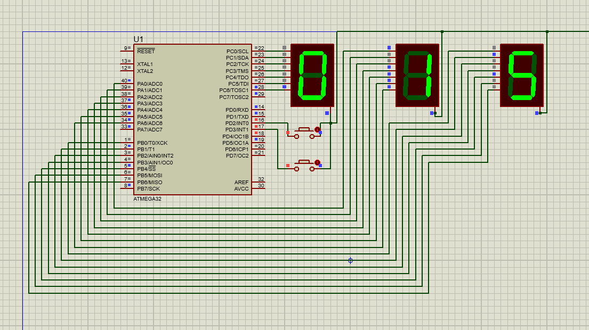

# AVR Seven-Segment Display Counter

This project is an embedded application for the ATmega32 microcontroller. It uses three seven-segment displays to show a number, and two buttons are used to increment or decrement the value displayed on the seven-segment display.

## Screenshot

## Features

- **Three Seven-Segment Displays**: Displays a 3-digit number, incrementing or decrementing based on the button presses.
- **Two Buttons**: One button increases the displayed number, while the other decreases it.
- **ATmega32 Microcontroller**: The program is designed for the ATmega32 with an 8 MHz clock frequency.

## Hardware Setup

- **Microcontroller**: ATmega32
- **Seven-Segment Displays**: 3 seven-segment displays connected to ports A, B, and C.
- **Buttons**: Two push-buttons connected to pins PD2 and PD3.

### Button Functions
1. **Button 1 (connected to PD2)**: Increases the number on the seven-segment display by 1.
2. **Button 2 (connected to PD3)**: Decreases the number on the seven-segment display by 1.

## Connections

1. **Seven-Segment Displays**: 
   - The displays are connected to ports A, B, and C. Each display shows one digit of the 3-digit number.
   - The segments of each display are controlled through the corresponding port registers (PORTA, PORTB, PORTC).
   
2. **Buttons**: 
   - **Button 1** is connected to **PD2** (used to increment the number).
   - **Button 2** is connected to **PD3** (used to decrement the number).

## Code Explanation

1. **Port Initialization**: 
   - Ports A, B, and C are configured as output to control the seven-segment displays.
   - Port D is configured with PD2 and PD3 as input to read the buttons, while the other bits are set as outputs for other functionality.

2. **Seven-Segment Display Control**:
   - The program uses an array `seven_seg[]` to store the hexadecimal values that represent the segments of the seven-segment displays for the digits 0-9.
   - The values corresponding to the digits are written to PORTA, PORTB, and PORTC to update the display.

3. **Button Handling**:
   - When Button 1 (PD2) is pressed, the program increments the number on the display. The value of the digits is updated accordingly. If the number exceeds 9, it wraps around to 0.
   - When Button 2 (PD3) is pressed, the program decrements the number on the display. If the number goes below 0, it wraps around to 9.

4. **Debouncing**:
   - The program includes simple delay functions (`delay_ms`) to debounce the buttons and prevent multiple increments or decrements from a single press.

## Installation

1. Connect the ATmega32 microcontroller to the development board.
2. Wire up the three seven-segment displays to ports A, B, and C.
3. Connect the two push-buttons to PD2 and PD3 for increment and decrement functionality.
4. Compile the code using an AVR toolchain (e.g., Atmel Studio or CodeVision).
5. Flash the firmware onto the ATmega32 microcontroller.

## Usage

Once the program is flashed onto the ATmega32, it will display a 3-digit number on the seven-segment displays. Pressing Button 1 will increase the number, and pressing Button 2 will decrease it. The number will loop between 0 and 999 as it reaches its limits.

## Example Display Output

- When the program starts, the seven-segment displays show "000".
- Pressing Button 1 will increment the number: "001", "002", ..., "999".
- Pressing Button 2 will decrement the number: "998", "997", ..., "000".

## Troubleshooting

- **Seven-Segment Display Not Working**: Double-check the connections for each segment of the seven-segment displays and ensure they are correctly wired to the respective ports.
- **Button Not Responding**: Verify the connections to PD2 and PD3 and ensure that the buttons are properly wired to ground when pressed.

## Author

- Created by [Mohammd H. Moazzen](https://github.com/TirdadMH) 
- Date: June 13, 2023